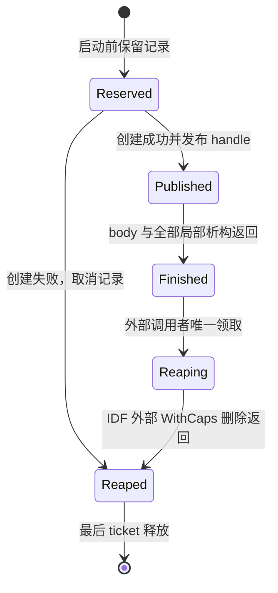

# 030 视频任务回收与延后导航合同

更新：2026-10-09。030 源码 `34c9e645` 已完成制品独审，并以包 `20261008-055334` 保 NVS 部署；
有限正常视频、四格启停顺序与远程 pointer Home 证据见下文。028 的 Home `queued:false`、
027 的停顿及资源、并发、质量和长稳门禁继续保留，不追溯改写历史结果。

048 在该导航合同上补充应用替换顺序：候选 app 的 factory 成功后，宿主先暂停当前 app，
再调用候选 `OnCreate`；候选创建失败时恢复当前 app，创建成功后才销毁已暂停的旧 app。
049 进一步让 Camera 暂停时等待 LVGL 所有权，删除 Camera UI 与全部 timer、释放预览像素，
再停止预览并释放音频焦点；候选创建失败时重建 Camera UI 并重新调度预览。销毁阶段仍保留一次
幂等停止，供底层待重试释放继续收敛。050 实机快照确认上述三个释放阶段的最大内部/DMA 连续块
均为 16,384 B，随后 Home 重建才降至 6,144 B。051–055 将首屏 Home 内部分配从约 14.8 KiB
降至约 6.2 KiB；056 再在 Camera 运行期保留并于 preview 停止后释放 8,192 B 连续块，使
Camera → Home 的全部重建阶段和 65 秒健康窗口均保持 8,192 B internal/DMA largest。该短窗口
连续块门禁已关闭；Voice supervisor 2,384 B 栈余量、物理画质、任意 OOM/并发和资格长稳仍
保持资源/生产 NO_GO。

后续 [031 语音回收](voice-task-retirement.md) 已在本地源码中迁移三个语音任务并完成软件与
构建验证，尚未构包部署。本页的 030 软件计数、五条视频范围和有限设备证据保持原身份。

## 业务结束与任务回收

ESP-IDF 6.0.2 的 `vTaskDeleteWithCaps(nullptr)` 自删除路径会创建临时
`prvTaskDeleteWithCapsTask`，再由它释放原任务的 TCB 与栈。创建清理任务失败会 `abort()`。
业务已经释放相机或 peer，不代表该任务退出不再需要内存，也不代表栈已归还。

原服务还会先清空 active handle 或发布业务完成，再析构局部 callback。某个 callback 的最后
引用析构时，可以重入服务并启动替代流；只等待 active handle 变空会漏等旧局部对象，而反复读取
当前 handle 又可能错误等待替代流。

030 通过共享 `main/phone_os/task-retirement.{h,cc}` 为每代任务保留独立凭据：

业务层的“已停止”不属于上图的 `Finished`。共享入口必须等完整业务函数返回，才能标记可回收。

## 任务归属与停止规则

- 首次准入时申请固定 16 槽的 PSRAM 记录池；不回退内部堆。池不可用、槽用尽、owner 已关闭或
  代号耗尽均拒绝新的准入。记录池常驻，不能把它计成零运行成本或实测内存收益。
- 记录保存数值 owner 和 generation，不保存 owner 对象指针。ticket 的复制、替换由服务锁保护；
  共享注册表只保护记录本身。
- 先保留记录，再创建 WithCaps 任务。共享入口在 handle 发布前等待，不能提前进入业务函数；
  创建失败取消新记录，并保留先前票据，避免后续 Stop 漏等旧代。
- 业务清理可以允许下一代启动，但保留最近一次 ticket。外部 Stop 在服务锁内复制准确票据并
  请求停止，释放服务锁后 Join；Join 不追读或等待之后启动的新代。
- 当前 worker 的 self-Stop 只请求业务停止，不 join 或删除自身。业务函数及 callback 局部析构
  完整返回后，共享入口发布 `Finished`，随后仅停驻，不再访问服务对象或持有需要析构的局部所有权。
- 外部 Stop 或 `app_main` 常驻循环中的 `PumpTaskRetirements()` 唯一领取已完成记录。
  调用真实 `vTaskDeleteWithCaps(saved_handle)`，由该版本 IDF 先 suspend、等待所有核不再运行
  目标任务，再删除并释放 TCB/栈。并发 Stop/Pump 不重复删除。
- 析构顺序为关闭新准入、请求业务停止、Drain 全部所属代，再销毁业务互斥量和服务资源。
  从自身 worker 销毁 owner 属于无效生命周期，不能把无法 self-join 当成已安全退出。

回收机制不在退出时申请记录或创建清理任务。此保证仅覆盖任务退役基础设施；peer 关闭、日志、
业务 callback 以及 callback 主动启动新流仍有各自的分配和失败边界。外部回收可以等待业务退出与
跨核收敛，没有硬性完成期限；主循环的周期调用也不是实时调度保证。

## 已迁移范围

| 服务 | 030 路径 | 保留的业务边界 |
| --- | --- | --- |
| `CameraService` | Preview、JPEG 两个 worker | 本地/远端 preview lease；最后 owner 才请求停止；最终帧和 callback 生命周期 |
| `DisplayService` | JPEG worker | 逐帧共享 callback；析构可启动 replacement；旧 Stop 只等待旧代 |
| `WebRtcCameraService` | peer worker | SDK main loop 与 send/close 串行；原终态 callback |
| `WebRtcDisplayService` | peer worker | 原 stream lease、ACK、控制撤销和 JPEG 所有权；cleanup 移动而非复制 control callback |

两种 peer 自主发生 SDK 错误或断连后，即使没有下一次 Start/Stop，常驻 Pump 也会回收完成的任务。
`stopped` 日志仍先于完整 body 返回，不能单凭该日志确认任务栈已释放。

030 只有上述 **5 条视频任务路径**。`VoiceWakeService`、`VoiceAudioFrontend`、
`VoiceAssistantService` 的 3 条 WithCaps 自删除当时未迁移，后续源码范围见
[031 合同](voice-task-retirement.md)。028 的底层 DVP worker 修复保持
原有范围；030 不改变视频格式、栈容量/能力、优先级、核心固定规则或普通信令合同。

## 串口与 Camera 的预建导航队列

`PhoneSystem::Start()` 在接受媒体导航前建立 `DeferredNavigation`：4 个 pending 槽位的 PSRAM
环形队列，以及一个周期为 30 ms 的 LVGL timer。一个请求出队执行时，其槽位可以再次使用，
因此最多是 4 个待执行请求另加 1 个正在执行的请求。串口 app-launch callback 只在系统成功启动后注册，
避免与注册表构建、初次 Home 创建重叠。

`RequestLaunch` 以无临时字符串分配的比较解析已冻结注册表的 ID、标题和别名，保留既有归一化
语义；队列复制 canonical ID，不借用串口字符串。空/未知身份、超过 63 字节、内含 NUL、未初始化、
关闭或满队列均不准入。满队列不覆盖旧请求，不安排后台自动重试。串口生产者不再为导航等待
`lvgl_port_lock(1000)` 或逐请求调用 `lv_async_call`。

timer 在 LVGL 线程每次至多执行一个请求；当前事件/生命周期回调返回后才进入后续导航。
Camera 的 Back/Home 按钮使用同一个预建入口。拒绝时显示“返回桌面失败，请重试”，后续点击是
一次新请求。其他应用和其他 `lv_async_call` 路径没有在本次批量迁移。

应用替换不再先创建新页面再暂停旧页面。候选 factory 仍在暂停前运行；factory 失败或返回空对象
不会扰动当前 app。factory 成功后，当前 app 的 `OnPause` 必须完成，候选 `OnCreate` 才开始。
候选创建失败且清理成功时，宿主调用旧 app 的 `OnResume` 并重置输入状态；候选创建成功时，
旧 app 不重复暂停，直接销毁后再恢复新 app。Camera 因此在 Home `OnCreate` 前删除旧 UI/timer、
释放预览像素并停止预览；若候选创建失败，会重建 Camera UI 并重新启动预览。未知
pause/resume/teardown 异常仍中止。

串口仍区分 `RODAK_APP_LAUNCH_RESULT {"queued":true}` 与稍后的
`RODAK_APP_LAUNCH_COMPLETE {"ok":...}`。准入不代表已进入 Home，也没有 30 ms 完成期限：
LVGL 正在绘制、Camera Start/Stop、前序请求或其他生命周期工作都可能延后执行。
关闭队列撤销未执行请求并各调用一次失败完成回调；已经执行的请求不能由 Close 撤销其 UI 效果。

只有 factory/预分配失败，以及 `OnCreate` 失败后成功完成 `OnDestroy` 清理，才返回失败完成。
`PhoneAppHost` 以 RAII 恢复 transition 标记；部分创建失败会先清理 UI/timer。未知生命周期
dispatch 异常或 teardown 清理失败则中止，避免把可能悬挂的 timer userdata 留给后续导航。
因此已准入请求在这种致命错误下不保证还能输出完成行。completion 通知异常仍被记录、隔离且不重放。
这不是对任意 app 异常、回调自身副作用或任意 OOM 的完整回滚承诺。
队列的初始化、关闭和销毁与 LVGL 同步；完成回调的上下文须存活至执行或取消完成。

预建 timer 只是把分配移到启动阶段，真实 LVGL 的 malloc assert 仍然适用。队列占用和服务记录也
增加常驻资源，不能据此宣称净内存节省或充足余量。旧 028 Home 拒绝日志不能区分当时的 LVGL
锁等待失败与异步入队失败；新的主机回归不证明那次实机失败的根因。

## 软件证据与未关闭门禁

| 验证目标 | 已记录结果 | 证据边界 |
| --- | --- | --- |
| [共享回收](../tests/task_retirement/README.md) | Debug 13/13 CTest（含 6 个完整 TU 负变体）；ASan/UBSan 12/12 CTest | 编译真实 IDF WithCaps 函数链；调度、核查询与底层分配为 host 替身；6 个变体没有另跑 sanitizer |
| [Camera 服务](../tests/camera_capture/README.md) | Debug、Release、ASan/UBSan/leak 各 7 CTest，含 45 项 Camera 用例 | 两条旧源码退出红例；创建失败丢失前代票据的负控；设备/编码器仍为替身 |
| [Display 服务](../tests/display_service/README.md) | Debug 与 ASan/UBSan/leak：33 项正向、2 个退役负控 | 完整生产 TU；旧完整源/头另行命中预期 IDF cleanup 分配失败 |
| [两种 peer/ACK](../tests/display_control_ack_service/README.md) | Debug 与 ASan/UBSan/leak：61 项正向、既有 5+4 个负控、新增 4 个退役负控 | 真实服务与 SDK 头；传输替身；两份旧完整源/头各有独立红例 |
| [真实 LVGL 导航](../tests/navigation_ui/README.md) | Debug 与 ASan/UBSan/leak 各 13 项通过 | 实际 System/Navigation/Registry/Host/CameraApp/PhoneUi；覆盖旧 app 先暂停、候选失败恢复及 3 个指定 marker + SIGABRT 的子进程负控 |
| [Camera UI](../tests/camera_ui/README.md)、app-model | Camera UI Debug 与 ASan/UBSan/leak 各 13 项；app-model Debug 278 项通过 | 与新导航专用目标、设备验证分别记账 |

主机删除替身在真实 IDF 外部删除路径检查核收敛，并实际 join worker 后才允许取出和释放其
模拟 TCB/stack。旧源红例必须以指定 cleanup-task 申请拒绝双标记和 SIGABRT 结束；普通构建失败、
超时和无关 sanitizer 错误均不算检出。它们不是成功退出结果，也不提供设备端故障重现证据。

本地封存清单不随仓库提交，摘要定位如下：

- 候选 `34c9e645` 的总软件独审为 Rodak
  `.codex-temp/task-retirement-030/software-review/seal-34c9e645-20261008/software-verification.json`，
  SHA-256 `4a229beba08f8c708ebe3805c9461cd9ed4e2b1553cc679943fcd14db3cace51`。
  下列早期分项记录保持原身份；辅助 pin 工具的后续变化由总独审单列，不把旧指纹冒充当前输入。
- RodakOS `.codex-temp/task-retirement-030/verification.json`：
  SHA-256 `baa66a666bd29d984cb6063ec350b4db6be618ad39623b52e6c56f982bc52257`。
- Rodak `.codex-temp/task-retirement-030/camera/software-verification.json`：
  SHA-256 `f4ef12af69d0e74f3c749106b39ff52f70866a57e88695e41b8950b6b0081a49`。
- Rodak `.codex-temp/task-retirement-030/ack/software-evidence.json`：
  SHA-256 `8935eb2c4c988bb6fb7aef08ae49a450011b5e78298ff4a086d4d5ebf8af3bf6`，321 个封存文件。
- 导航最终异常边界的记录为 Rodak 同目录的 `navigation-debug-test-sealed-v2.log` 与
  `navigation-asan-test-sealed-v2.log`。子进程若从危险操作返回，会在对象析构前立即以 91 退出，
  避免把析构兜底的 SIGABRT 当成即时失败关闭。此前测试、失败及命令层错误日志均保留。
- Camera UI ASan 追加独审为同目录
  `navigation-review/camera-ui-asan-resource-20261008/verification.json`，
  SHA-256 `f7f5b86f703fe1fa3a77bde479989f361fb4402e915a227d8460a8c9799a93a7`。

本地 ESP-IDF 6.0.2 构建通过。主应用按 `ota_0` 槽打包；根目录默认 flash 命令及 Recovery
分区大小提示不能作为部署入口，仍须使用保 NVS 的专用构包与刷写流程。

## 030 制品与有限设备证据

原开发签名根的包 `20261008-055334` / `task-retirement-030` / `0.1.2-dev.1` 已部署到
`44:1b:f6:c3:b4:30`。制品独审核对源码/对象/map/ELF、签名、ZIP 和分区；五项不可变文件、
authority v3 以及 029 AES/Camera 生成补丁保持。目标回收池申请 448 B PSRAM，导航环申请
304 B PSRAM；回收内部符号 21 B、含对齐跨度 24 B，均不能换算成设备净内存收益。

关闭的 normal/matrix 窗口共得到 **7 条关联 `stopped`**，每次 Stop 后原始串口覆盖均超过 60 秒。
矩阵按 m2→m1→m3→m4 执行四种本地 Camera/远端 Display 顺序，随后 b1 通过正常远程 pointer
点击 Camera Home；9 条串口请求均有 `queued:true` 与 `complete ok:true`。b1 没有串口 Home，
也不属于 GT911 实体触摸。m2 过早截图仍是旧 Camera 图，保留原件并仅采用后续确认图证明 Home。

冷 helper 的 70 秒 monotonic 截止与 68.831 秒实际数据跨度分开记账；cold/normal/matrix 的
2/44/89 条警告和错误均保留。没有观察到 fatal、重启或 MQTT 断连，但该 boot 的内部堆最低仅
359 B。终态保持原绑定/token4、MQTT 在线、voice 未连接，图像为 0、远控关闭、采集已关闭。

精确身份、软件/制品/硬件摘要及最后 Main/DMA 样本见
[030 release readiness](ota-release-readiness.md#2026-10-08-video-task-retirement-and-navigation-030)；
逐格截图和时间边界见 [Rodak 跨仓详细记录](https://github.com/rymcu/rodak/blob/master/docs/video-task-retirement-verification.md)。
暗 Camera 图不作为成像质量通过；软件回收与 `physicalVerified=false` 回执不证明全部物理资源归还。
该 030 包中的 voice 仍未迁移；031 仅提供后续软件记录，未补足设备退出验收。
任意 OOM、DMA/IRQ/cache-off、音频/SD/TLS 并发及长稳仍未关闭，
资源和生产发布保持 **NO_GO**。
