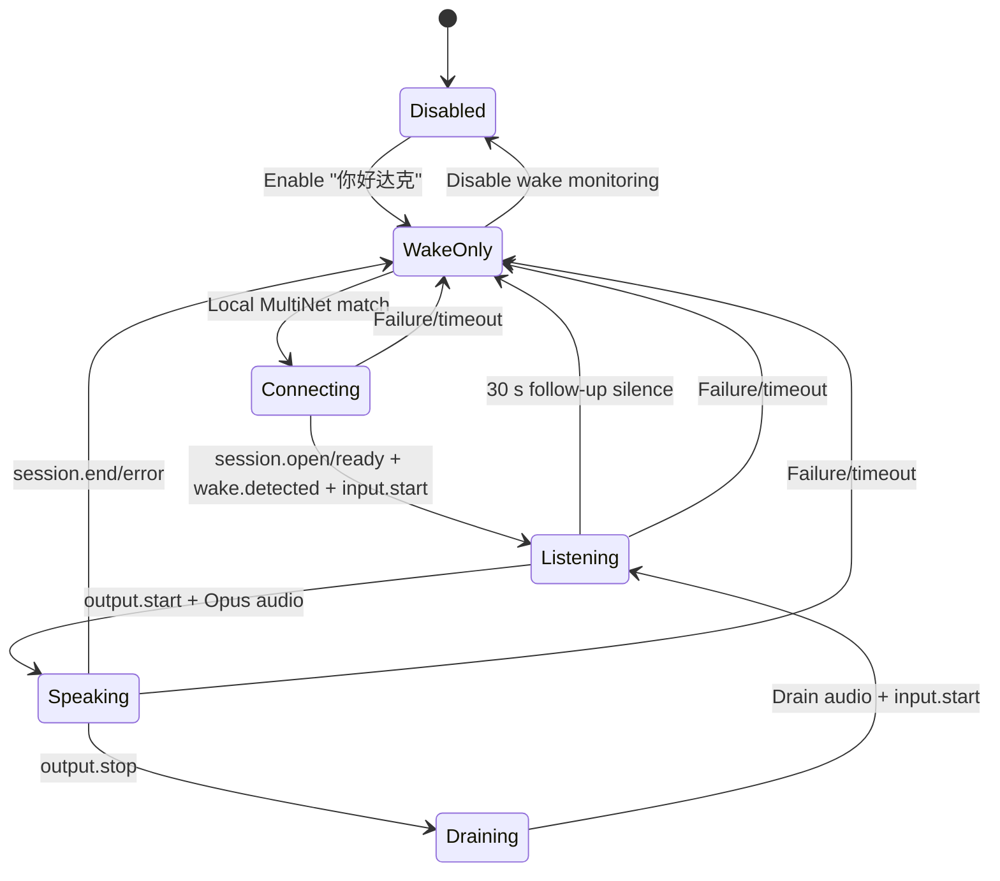

# Voice Assistant Integration

RodakOS provides a multi-turn voice assistant backed by Rodak. The device performs local wake
monitoring for **"你好达克"** and opens the cloud voice session only after a successful local
detection. One wake continues across replies on the same WebSocket until `session.end`, 30 seconds of
follow-up silence, or an error/watchdog ends the session; idle standby never keeps a cloud voice
session open.

## Product Boundaries

- ESP32-S3 owns wake detection, microphone capture, Opus encode/decode, playback, audio focus, and
  the device-side state machine.
- Rodak owns ASR, intent/agent execution, LLM generation, TTS, conversation state, and audit data.
- Idle wake monitoring is local. It must not keep a WebSocket, ASR stream, or cloud session alive.
- The Assistant app is a configuration and status surface. It is not a Talk/Stop interaction page.
- A missing `voice_wake/enabled` preference is initialized to enabled and committed to NVS. A
  subsequent explicit disable remains authoritative across app launches and device restarts.
- Device Cloud, provisioning, WiFi, MQTT, and OTA remain system services consumed by the assistant;
  the assistant does not duplicate their configuration or lifecycle.
- Wake handling uses the canonical `realtimeVoice` descriptor and the AIoT device token cached by
  Device Cloud. Provisioning refresh remains
  an explicit system-settings action and never blocks microphone capture after a wake match.

## State Flow

The wake callback runs outside the ADC capture task so DNS, TLS, and WebSocket setup cannot block
audio sampling. A supervisor observes the assistant state and re-arms local monitoring after the
interaction reaches idle.

## Audio Ownership

`AudioCodecInput` arbitrates the shared ADC by owner and priority:

| Consumer | Owner | Priority | Behavior |
| --- | --- | ---: | --- |
| Local wake monitor | `voice-wake-frontend` | 10 | Runs while enabled and idle |
| Recorder app | `recording-service` | 20 | Temporarily preempts wake monitoring |
| Assistant session | `voice-conversation-frontend` | 30 | Preempts wake monitoring while the session is active |

Wake and conversation use distinct owners so a stale wake capture iteration cannot lower the active
conversation priority. A failed open rolls the frontend back to idle instead of retrying outside a
valid session.

Assistant playback requests exclusive focus. Active music reaches a confirmed pause boundary and
releases the DAC; after TTS drains, music reopens its original format and resumes from its retained
decode position. Recorder and camera requests intentionally keep their existing non-resuming focus
policy.

## Wire Contract

- Transport: canonical `rodak-realtime-voice/v1` over WebSocket at the `realtimeVoice.endpoint`
  advertised by Rodak AIoT bootstrap/token. RodakOS does not parse or emit XiaoZhi wire messages;
  XiaoZhi firmware compatibility belongs exclusively to a Rodak server adapter.
- Uplink/downlink: each binary WebSocket message uses the canonical `RAV1` envelope: 4-byte magic,
  big-endian positive sequence (starting at 1), big-endian payload length, then one Opus packet. Uplink is 16 kHz, mono,
  60 ms; downlink uses the format returned by `session.ready`. Descriptor validation, cached
  configuration and the handshake share the supported downlink frame durations: 5, 10, 20, 40,
  and 60 ms.
- The device sends `session.open` and validates `session.ready` before it uploads audio. The
  descriptor's `limits` bound audio and control frames; the transport adds no XiaoZhi v2/v3 wrapper.
- VAD authority is negotiated with `vadStrategies` and `preferredVadStrategy`; the server returns
  `vadStrategy` in `session.ready`. The device suppresses device-VAD control events when the server
  selects `server-authoritative`, while `hybrid-fallback` keeps audio flowing to server VAD if device
  boundaries time out.
- Text and binary input accept both transport-buffer chunks and WebSocket continuation frames. Text
  messages are limited to 64 KiB and binary audio messages to 8 KiB.
- The device sends `wake.detected` with `text: "你好达克"`, followed by `input.start` in realtime
  mode. Each later non-terminal reply starts another `input.start` on the same session without
  repeating `wake.detected`.
- `output.start` stops microphone upload when AEC is disabled. Binary Opus frames are decoded and
  queued to the DAC. `output.stop` drains the estimated playback tail and closes the DAC.
- The follow-up window is 30 seconds and is re-armed when capture restarts. A new `output.start` proves
  the next turn progressed and clears that deadline. Silence, an error, a connection/listening
  watchdog, or Rodak's explicit `session.end` ends the session and restores local wake monitoring.
  Active TTS playback is not terminated by that watchdog.

The service also exposes a speaking-time interruption path for an AEC/VAD frontend. A confirmed
barge-in sends `playback.abort` with `reason: "vad_detected"` on the existing session, closes local TTS output, and
discards late audio until the next `output.start`. The wake service routes this detection to the
existing interaction instead of opening a second session. This remains gated by validated echo
cancellation or voice activity detection; the built-in wake runtime still runs only in normal
listening mode.

The recorder starts before cloud setup and retains the newest 80 frames (about 4.8 seconds) so speech
that follows the wake phrase can survive normal DNS/TLS/WebSocket setup latency. If setup exceeds the
buffer, the oldest frames are discarded.

## Local Model Packaging

RodakOS uses:

- `espressif/esp-sr` 2.2.2
- Chinese MultiNet5 quant8
- custom command `ni hao da ke`, displayed and sent as `你好达克`
- `78/esp-opus-encoder` 2.4.1

The Recovery partition table is immutable and has no model partition. During the build,
ESP-SR's `movemodel.py` generates `build/srmodels/srmodels.bin`; CMake embeds it in
`rodakos.bin` as `_binary_rodakos_voice_models_start/end`. Model scripts and model data are explicit
build dependencies, so component updates regenerate the bundle.

ESP-SR 2.2.x still requests the ESP-IDF 5 component name `json`. The local `components/json/` shim
maps that name to IDF 6's managed `espressif__cjson` without editing `managed_components/`.
Its prebuilt FST library also references newlib's legacy `_ctype_` byte table. On IDF 6, the project
defines that link symbol as picolibc's equivalent `_ctype_b + 127`; this is a link-time alias, not a
runtime pointer object. ESP-DSP 1.6.0 receives `<cmath>` through a target-local compile option for
the GCC 15 transition. Both compatibility fixes stay in `main/CMakeLists.txt`.

## Verification Gates

Before hardware testing:

1. `idf.py build` succeeds with ESP-IDF 6.0.2.
2. `build/srmodels/srmodels.bin` exists and the ELF contains
   `_binary_rodakos_voice_models_start/end`.
3. `build/rodakos.bin` fits `ota_0`; do not use the Recovery size warning as the main-image target.
4. `flash_and_test.ps1 -Port COM3 -VerifyOnly` confirms the installed partition table and immutable
   Recovery hash before any write.

On hardware, verify:

- idle startup has no realtime voice WebSocket connection;
- enabling the switch loads MultiNet and opens the ADC locally;
- one utterance of "你好达克" creates exactly one wake-triggered session;
- `session.open`, `session.ready`, `wake.detected`, and `input.start` appear only after the local match;
- at least six consecutive questions work without repeating the wake phrase and retain one WebSocket and
  session id, with one new `input.start` after each non-terminal `output.stop`;
- Rodak receives valid Opus and returns audible TTS without a clipped final syllable;
- no intermediate turn releases focus, closes the WebSocket, or re-arms MultiNet;
- saying "再见" produces `output.stop`, then `session.end`, one cleanup, and local wake re-arm;
- 30 seconds of follow-up silence closes the session safely after any completed reply;
- music pauses and resumes, while Recorder can temporarily preempt wake monitoring;
- disabling wake monitoring closes the ADC owner and does not reconnect to the cloud.

Normal refresh must write only `otadata` and `ota_0` after `-VerifyOnly` passes. Never erase or
overwrite NVS, Recovery, the partition table, or the OTA journal during routine assistant testing.
