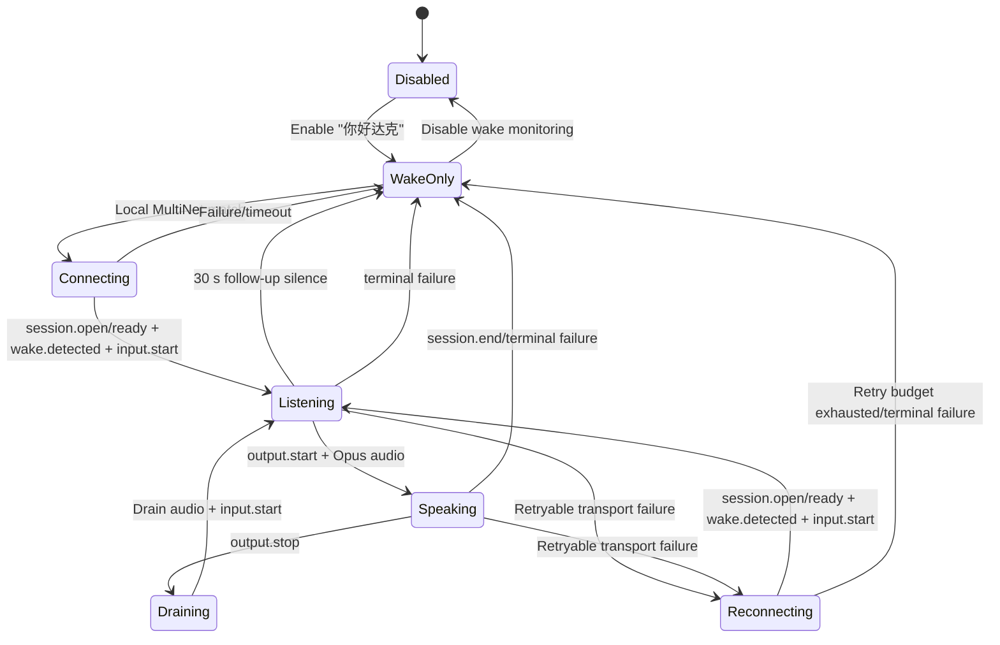

# Voice Assistant Integration

RodakOS provides a multi-turn voice assistant backed by Rodak. The device performs local wake
monitoring for **"你好达克"** and opens the cloud voice session only after a successful local
detection. One wake continues across replies on the same WebSocket until `session.end`, 30 seconds of
follow-up silence, or a terminal failure ends the session. A retryable failure in an established
interaction is recovered with bounded backoff; idle standby never keeps a cloud voice session open.
The normative wire details live in [Rodak realtime voice v1](rodak-realtime-voice-contract-v1.md).

## Product Boundaries

- ESP32-S3 owns wake detection, microphone capture, Opus encode/decode, playback, audio focus, and
  the device-side state machine.
- Rodak owns ASR, intent/agent execution, LLM generation, TTS, conversation state, and audit data.
- Idle wake monitoring is local. It must not keep a WebSocket, ASR stream, or cloud session alive.
- The Assistant app is a configuration and status surface. It is not a Talk/Stop interaction page.
- A missing `voice_wake/enabled` preference is initialized to enabled and committed to NVS. A
  subsequent explicit disable remains authoritative across app launches and device restarts.
- Device Cloud, provisioning, WiFi, MQTT, and OTA remain system services consumed by the assistant;
  the assistant does not duplicate their configuration or lifecycle.
- Wake handling uses the canonical `realtimeVoice` descriptor and the AIoT device token from
  Device Cloud. After microphone capture starts, a new wake verifies token freshness on the existing
  internal-stack wake worker and refreshes expired or unverified credentials with the paired device
  secret. A valid token is reused until shortly before its advertised `expiresIn`; monotonic expiry
  is kept only in RAM, so a reboot requires verification again. This does not create a new pairing.
  Reconnect uses the prepared RAM snapshot without NVS access; an expired snapshot ends that
  interaction, and the next wake refreshes credentials. HTTP authentication rejection is not retried.
  MQTT also refreshes once before its first connection after boot so cached broker addresses can
  follow the configured bootstrap server. A transient bootstrap failure retains the cached fallback.
  Credential preparation uses a shared three-second budget for lock waiting and HTTP stages.
  This is cooperative: an in-flight DNS or HTTP library call can return later, after which its
  result is rejected. Immediate Stop cancellation during those calls remains a hardware gate.

## State Flow

The wake callback runs outside the ADC capture task so DNS, TLS, and WebSocket setup cannot block
audio sampling. A supervisor observes the assistant state and re-arms local monitoring after the
interaction reaches idle.

## Audio Ownership

`AudioCodecInput` arbitrates the shared ADC by owner and priority:

| Consumer | Owner | Priority | Behavior |
| --- | --- | ---: | --- |
| Local wake monitor | `voice-wake-frontend` | 10 | Runs while enabled and idle |
| Recorder app | `recording-service` | 20 | Temporarily preempts wake monitoring |
| Assistant session | `voice-conversation-frontend` | 30 | Preempts wake monitoring while the session is active |

Wake and conversation use distinct owners so a stale wake capture iteration cannot lower the active
conversation priority. A failed initial open rolls the frontend back to idle instead of retrying
outside a valid session.

Assistant playback requests exclusive focus. Active music reaches a confirmed pause boundary and
releases the DAC; after TTS drains, music reopens its original format and resumes from its retained
decode position. Recorder and camera requests intentionally keep their existing non-resuming focus
policy.

## Wire behavior

The device uses `rodak-realtime-voice/v1` over the endpoint supplied by the AIoT
descriptor. It sends `session.open`, validates one matching `session.ready`, then
sends `wake.detected` and `input.start` before uploading RAV1-wrapped Opus. The
uplink is fixed at 16 kHz mono/60 ms; downlink format is negotiated. Audio and
control messages use the descriptor's negotiated limits (defaults 8 KiB and
64 KiB; audio payloads are capped at 64 KiB and inbound text is currently
buffered at 64 KiB). See the canonical
[voice contract](rodak-realtime-voice-contract-v1.md) for event schemas,
generation/session/epoch gates, MCP, error handling, and the complete RAV1 layout.

VAD authority is negotiated with `vadStrategies` and `preferredVadStrategy`.
When the server selects `server-authoritative`, the device keeps streaming audio
but suppresses device VAD events. `hybrid-fallback` permits device boundaries
when server-side boundaries do not arrive.

Each later non-terminal reply starts another `input.start` on the same session
without repeating `wake.detected`. `output.start` marks a playback epoch and
binary Opus frames are decoded and queued to the DAC. `output.stop` drains the
estimated playback tail before the next turn. Capture remains available during
TTS so the AEC/VAD frontend can detect barge-in; `StopRecorderForPlayback()` is
intentionally a no-op in the current service.

The follow-up window is 30 seconds and is re-armed when capture restarts. A new
`output.start` proves the next turn progressed and clears that deadline. Silence,
a terminal error, a connection/listening watchdog, or Rodak's explicit `session.end`
ends the session and restores local wake monitoring. Active TTS playback is not
terminated by that watchdog.

## Reconnect Policy

An initial interaction becomes established only after `session.ready`, `wake.detected`, and the first
`input.start` all succeed; `session.open` is a prerequisite of `session.ready`. A failure before that
point ends the wake interaction. Once those commands complete, a retryable failure remains eligible
for reconnect even when the first `output.start` has not arrived; the device does not create a cloud
connection while idle.

For an established interaction, the I/O task retries network disconnects, server `retryable: true`,
WebSocket `1011`, `1012`, or `1013`, connect/session-ready timeouts, and failed sends. It does not
retry `session.end`, user stop or deinitialization, close `1002` or `4001`,
authentication/configuration failures, protocol violations, or server `retryable: false`. The policy
permits three attempts with exponential backoff starting at 250 ms and capped at 8 s.

Each retry closes and waits for the previous transport, opens a new connection, receives
`session.ready`, restores `wake.detected`, and starts realtime input. Only after that sequence is the
new transport active. The temporary generation binding used while restoring commands only queues
new-generation callbacks; it cannot deliver audio or TTS before the retry commits. Recorder frames,
queued inbound events, playback state, and the Opus decoder are discarded at the recovery boundary so
audio from the old session never crosses into the new one. Stop and deinitialization close the
transport before waiting for the I/O task, which releases a blocked open attempt.

The service also exposes a speaking-time interruption path for an AEC/VAD frontend. A confirmed
barge-in sends `playback.abort` with `reason: "vad_detected"` on the existing session, closes local TTS output, and
discards late audio until the next `output.start`. The wake service routes this detection to the
existing interaction instead of opening a second session. This remains gated by validated echo
cancellation or voice activity detection; the built-in wake runtime still runs only in normal
listening mode.

The recorder starts before cloud setup and retains the newest 80 frames (about 4.8 seconds) so speech
that follows the wake phrase can survive normal DNS/TLS/WebSocket setup latency. If setup exceeds the
buffer, the oldest frames are discarded.

## Local Model Packaging

RodakOS uses:

- `espressif/esp-sr` 2.2.2
- Chinese MultiNet5 quant8
- custom command `ni hao da ke`, displayed and sent as `你好达克`
- `78/esp-opus-encoder` 2.4.1

The Recovery partition table is immutable and has no model partition. During the build,
ESP-SR's `movemodel.py` generates `build/srmodels/srmodels.bin`; CMake embeds it in
`rodakos.bin` as `_binary_rodakos_voice_models_start/end`. Model scripts and model data are explicit
build dependencies, so component updates regenerate the bundle.

ESP-SR 2.2.x still requests the ESP-IDF 5 component name `json`. The local `components/json/` shim
maps that name to IDF 6's managed `espressif__cjson` without editing `managed_components/`.
Its prebuilt FST library also references newlib's legacy `_ctype_` byte table. On IDF 6, the project
defines that link symbol as picolibc's equivalent `_ctype_b + 127`; this is a link-time alias, not a
runtime pointer object. ESP-DSP 1.6.0 receives `<cmath>` through a target-local compile option for
the GCC 15 transition. Both compatibility fixes stay in `main/CMakeLists.txt`.

## Verification Gates

Before hardware testing:

1. `idf.py build` succeeds with ESP-IDF 6.0.2.
2. `build/srmodels/srmodels.bin` exists and the ELF contains
   `_binary_rodakos_voice_models_start/end`.
3. `build/rodakos.bin` fits `ota_0`; do not use the Recovery size warning as the main-image target.
4. `flash_and_test.ps1 -Port COM3 -VerifyOnly` confirms the installed partition table and immutable
   Recovery hash before any write.
5. The app-model tests cover only the pure realtime-voice contract and reconnect coordinator with a
   fake transport. They do not instantiate `VoiceAssistantService`, so production Stop/Deinit
   cancellation, release of a blocked open attempt, and decoder reset at the recovery boundary still
   require firmware and hardware verification.

On hardware, verify:

- idle startup has no realtime voice WebSocket connection;
- enabling the switch loads MultiNet and opens the ADC locally;
- one utterance of "你好达克" creates exactly one wake-triggered session;
- `session.open`, `session.ready`, `wake.detected`, and `input.start` appear only after the local match;
- at least six consecutive questions work without repeating the wake phrase and retain one WebSocket and
  session id, with one new `input.start` after each non-terminal `output.stop`;
- Rodak receives valid Opus and returns audible TTS without a clipped final syllable;
- no intermediate turn releases focus, closes the WebSocket, or re-arms MultiNet;
- saying "再见" produces `output.stop`, then `session.end`, one cleanup, and local wake re-arm;
- 30 seconds of follow-up silence closes the session safely after any completed reply;
- a forced network loss during an established interaction, including before its first `output.start`,
  retries at the bounded backoff, restores `session.ready`, `wake.detected`, and `input.start` in
  that order, and never replays pre-failure microphone or TTS data;
- server `retryable: false`, close `1002`/`4001`, explicit stop, and deinitialization do not retry,
  while close `1011`/`1012`/`1013` retries only after the interaction is established;
- music pauses and resumes, while Recorder can temporarily preempt wake monitoring;
- disabling wake monitoring closes the ADC owner and does not reconnect to the cloud.

Normal refresh must write only `otadata` and `ota_0` after `-VerifyOnly` passes. Never erase or
overwrite NVS, Recovery, the partition table, or the OTA journal during routine assistant testing.
